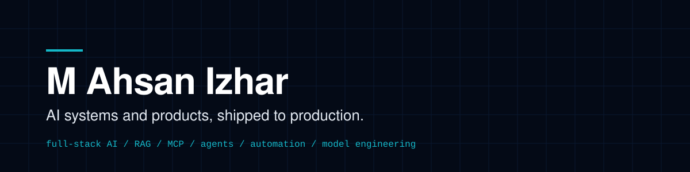

[Email](mailto:hello@ahsanizhar.com) / [ahsanizhar.com](https://ahsanizhar.com) / [Blog](https://blog.ahsanizhar.com) / [LinkedIn](https://linkedin.com/in/ahsanghalib)

I build production AI systems for businesses — from AI features and agents to workflow automation, RAG, integrations, and custom model engineering.

I'm a senior software engineer with 8+ years of production experience. Before moving fully into software engineering, I also spent 11 years working across accounting, IT, and running a business. That background affects how I approach AI: I start with the workflow, the data, the business rules, failure cases, and the outcome — not the model.

From 2021 to 2026, I led frontend engineering on a streaming platform spanning Web, Samsung TV, LG TV, and Chromecast, serving **988K+ subscribers**. I bring the same production mindset to AI systems: reliability, observability, security, evaluation, and maintainability matter as much as getting the model to produce the right answer once.

## What I build

**Full-Stack AI Product Development**  
Build complete AI-powered products from idea to production — frontend, backend APIs, databases, authentication, integrations, AI systems, infrastructure, deployment, monitoring, and everything required to operate the product.

**AI Integration Engineering**  
Add copilots, RAG, intelligent search, agents, tool calling, MCP, structured outputs, and other AI capabilities to existing applications and platforms.

**AI Workflow Automation**  
Automate document, email, data-entry, approval, and operational workflows using AI with validation, human controls, and integrations with existing business systems.

**AI Agents & Business Automation**  
Build agents and multi-step AI systems that work across CRMs, APIs, databases, communication tools, and internal software — with guardrails, auditability, approvals, and human escalation.

**Custom Model Engineering**  
Evaluate open and commercial models, build task-specific datasets and benchmarks, fine-tune models with techniques such as LoRA/QLoRA, optimize inference, and deploy specialized or private AI systems.

## Production track record

- Led frontend engineering for a multi-platform streaming product serving 988K+ subscribers
- Built AWS Lambda services for payment webhooks, marketing data pipelines and signup workflows
- Helped lead a JavaScript to TypeScript migration of a 1,528-file, 682K-line production app
- Introduced Turborepo across three codebases, cutting shared-code duplication by about 40%
- Maintain three published open-source libraries around DRM/video playback and React virtualization

## How I work

1. A short call to understand the problem and what a good result looks like.
2. A small, scoped pilot so you see working software early.
3. Production rollout, with tests, deployment and monitoring included.

## Stack

**Languages:** TypeScript, Python, JavaScript, Go
**AI:** agents, RAG, MCP servers, workflow automation, LLM API integration
**Production engineering:** Node.js, NestJS, AWS, Terraform, Docker, PostgreSQL, Redis, GitHub Actions

<!--
Uncomment this block once the projects are ready. Keep AI projects first.
Use the same format for each: the problem, what you built, stack, link.

## Selected work

**AI**
- [Project name](link): the problem it solves. What you built (agent, RAG, MCP server). Stack.

**Full-stack products**
- [Project name](link): what it does, who uses it. The web app, API and infrastructure you built around it. Stack.
-->
